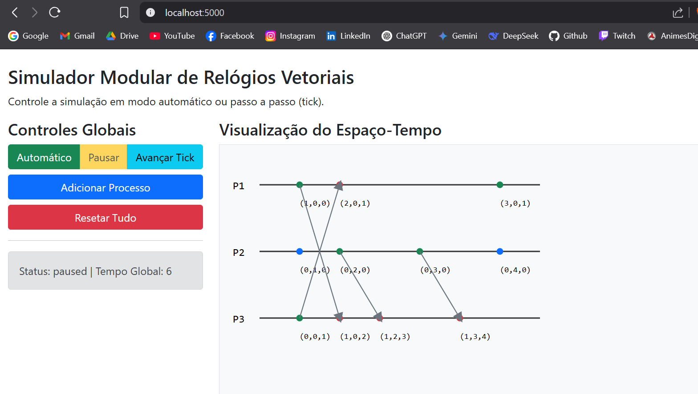

# 🕒 Simulador Interativo de Relógios Vetoriais

Trabalho prático da disciplina de **Sistemas Distribuídos - UFSC (2025.1)**  
Grupo 4 – Tema: **Relógios Vetoriais**

---

## 📌 Descrição

Esta aplicação simula o comportamento de **relógios vetoriais** em um ambiente distribuído. O sistema permite visualizar graficamente os eventos locais, envios e recebimentos de mensagens entre processos, bem como a atualização dos relógios vetoriais associados a cada evento.  
A simulação pode ser controlada em **modo automático** ou **manual (tick-a-tick)**.

---

## ✅ Requisitos funcionais

- ✅ Adição dinâmica de processos.
- ✅ Execução em tempo real com controle de simulação.
- ✅ Envio e recepção de mensagens com causalidade garantida.
- ✅ Interface web com exibição do relógio vetorial e espaço-tempo.
- ✅ Suporte a mensagens forçadas entre processos.
- ✅ Versão alternativa para execução em terminal.

---

## 💻 Tecnologias Utilizadas

- Python 3.12+
- Flask + Flask-SocketIO
- Threads e filas (`threading`, `queue`)
- HTML, CSS (Bootstrap), JS (Socket.IO + SVG.js)

---

## 🗂️ Estrutura de Diretórios

```

.
├── app.py                 # Servidor Flask com lógica principal
├── process.py             # Lógica do processo individual e relógios vetoriais
├── requirements.txt       # Alguns requirimentos
├── process.py             # Lógica do processo individual e relógios vetoriais
├── terminal\_runner.py     # Execução no terminal (modo texto)
├── templates/
│   └── index.html         # Interface da aplicação
├── static/
│   ├── css/style.css      # Estilo personalizado
│   └── js/simulation.js   # Lógica de visualização e controles
└── README.md              # Este documento

````

---

## 🧠 Como funciona

### 🧩 Conceito de Relógios Vetoriais

Cada processo mantém um vetor de inteiros onde:
- A posição `i` representa o número de eventos que o processo `i` já executou.
- A cada evento local ou envio de mensagem, o processo incrementa sua própria posição.
- Ao receber uma mensagem, o processo atualiza seu vetor usando o `max()` entre seu vetor atual e o vetor recebido.

### 🔄 Comunicação

A comunicação é gerenciada por uma thread que atua como **roteador de mensagens**:
1. O processo envia sua mensagem e vetor para uma fila central.
2. O roteador entrega a mensagem ao processo de destino.
3. O processo receptor atualiza seu vetor e gera um evento de recepção.

---

## 🌐 Interface Gráfica

A visualização interativa mostra:
- Linha do tempo de cada processo.
- Eventos: **local (🔵), envio (🟢), recepção (🔴)**.
- Vetor de relógio exibido abaixo de cada evento.
- Setas conectando envios e recepções de mensagens.
- Botões para iniciar, pausar, avançar e resetar a simulação.

 

---

## 📥 Instalação

### 🐧 Linux / 💻 Windows / 🍎 macOS

1. **Clone o repositório:**
```bash
git clone https://github.com/seu-usuario/simulador-relogios-vetoriais.git
cd simulador-relogios-vetoriais
````

2. **Instale as dependências:**

```bash
pip install flask flask-socketio
```

---

## ▶️ Como executar

### 💻 Modo Web

```bash
python app.py
```

Acesse no navegador:
`http://localhost:5000`

### 🖥️ Modo Terminal (sem interface gráfica)

```bash
python terminal_runner.py
```

Você verá no terminal os eventos dos processos e seus relógios vetoriais.

---

## 📌 Exemplos de Código

### ⏱️ Envio de mensagem com relógio vetorial:

```python
self.clock[self.process_id] += 1
message_id = str(uuid.uuid4())
self._create_event("send", self.clock.copy(), time_tick, receiver_id=receiver_id, message_id=message_id)
self.message_hub_queue.put((self.process_id, receiver_id, self.clock.copy(), message_id))
```

### 📨 Recepção e atualização do relógio vetorial:

```python
for i in range(current_len):
    self.clock[i] = max(self.clock[i], received_clock[i])
self.clock[self.process_id] += 1
self._create_event("receive", self.clock.copy(), time_tick, sender_id=sender_id, message_id=message_id)
```

---

## 📊 Requisitos do Trabalho Atendidos

* ✅ Comunicação cliente-servidor baseada em eventos.
* ✅ Processos com identificação única e relógios vetoriais individuais.
* ✅ Tela com mensagens enviadas, recebidas e ordem de execução.
* ✅ Código e README explicando comunicação, identificação e eventos.
* ✅ Diagrama visual com suporte a simulação passo a passo e modo automático.

---

## 📚 Referências

* Lamport, L. (1978). *Time, Clocks, and the Ordering of Events in a Distributed System*.
* Apostila da disciplina de Sistemas Distribuídos – UFSC 2025.1
* [https://en.wikipedia.org/wiki/Vector\_clock](https://en.wikipedia.org/wiki/Vector_clock)

---

## 👥 Autores

Nomes:
* André Lima
* Igor da Rosa
* Ítalo Manzine

---
